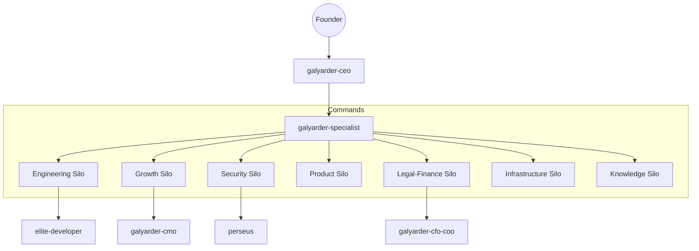

# Galyarder Framework: Institutional-Grade Agentic OS

  

## Humans 3.0: Autonomous Goal Integration

Galyarder Framework is the **Mission Logic Engine** designed to power high-scale digital empires. It bridges the gap between high-level strategic intent and ground-level deterministic execution across 8 specialized command silos.

### Global Command Architecture

### The 1-Man Army Strategic Loop

Every operation within the framework enforces a non-negotiable sequence of high-fidelity protocols to eliminate biological human error and ensure institutional-grade output.

| Protocol | Category | Tool | Mandatory Action |
| :--- | :--- | :--- | :--- |
| **Traceability** | Alignment | **Linear** | Project-scoped ticket lock before labor. |
| **Cognition** | Deconstruction | **Think MCP** | 8-phase logic mapping via `sequentialthinking`. |
| **Validation** | Engineering | **Context7** | Real-time fetch of official API documentation. |
| **Execution** | Efficiency | **RTK Proxy** | Surgical, token-efficient implementation. |
| **Persistence** | Memory | **Obsidian** | Durable departmental reporting. |

---

## Command Silos

-   :material-account-tie: **Executive**
    ---
    Strategic hegemony and master orchestration protocols.
    [Enter Command Silo](agents/index.md)

-   :material-hammer-wrench: **Engineering**
    ---
    Deterministic implementation and high-integrity TDD factory.
    [Enter Command Silo](skills/index.md)

-   :material-trending-up: **Growth**
    ---
    Behavioral arbitrage, marketing engineering, and design systems.
    [Enter Command Silo](design/index.md)

-   :material-shield-lock: **Security**
    ---
    Zero-trust auditing and advanced offensive security.
    [Enter Command Silo](skills/index.md)

---
© 2026 Galyarder Labs. Galyarder Framework. Engineering. Marketing. Distribution.
